# CieloOS Architecture

The whole system is one idea: **humans and agents emit the same typed commands on one bus**, and every command passes a single choke point that binds ownership, checks policy, and writes an audit event. Everything else — surfaces, sessions, brains, models — hangs off that spine.

```mermaid
flowchart TB
    subgraph client["Client — Mac / browser"]
        panel["Web panel · Vite+React (5173)"]
        viewport["Session viewport · Selkies desktop / ttyd console"]
        owui["Open WebUI (optional)"]
    end

    subgraph runtime["WorkspaceRuntime.Api — the ONE command bus (.NET 10, 5150)"]
        direction TB
        choke{{"AgentRuntime.SubmitAsync — single choke point"}}
        gate["Ownership gate + PolicyEngine (manifest) + Input grants"]
        audit[("Audit log · dual-actor")]

        subgraph surfaces["Surfaces · typed, policy-checked commands"]
            direction LR
            sf1["spreadsheet"]
            sf2["session"]
            sf3["console"]
            sf4["desktop"]
            sf5["session-input"]
            sf6["browser"]
        end

        subgraph agents["Agent loops + brains"]
            direction TB
            cloop["ConsoleAgentLoop"]
            dloop["DesktopAgentLoop"]
            chat["Chat brain · ConsoleBrainRegistry"]
            vis["Vision brain · ModelDesktopBrain"]
        end

        orch["SessionOrchestrator · podman"]
        inbox["SharedInboxWatcher"]
        localrt["Local inference router"]
    end

    subgraph sessions["Sessions — rootless podman containers"]
        direction TB
        console["console · ttyd + tmux + tools"]
        desktop["desktop · webtop XFCE + Selkies + ONLYOFFICE + xdotool/scrot/AT-SPI + Chromium/CDP"]
        searx["SearXNG · web search"]
        vols[("per-owner home volumes + shared volume")]
    end

    subgraph modelscope["Models — resolved per capability (chat / vision / embedding)"]
        direction LR
        deepseek["DeepSeek · cloud chat"]
        azure["Azure gpt-4.1-mini · cloud chat+vision"]
        bonsai["Bonsai-4B · local llama.cpp (8080)"]
    end

    store[("EF Core SQLite · identities · sessions · audit · grants")]

    %% entry paths all funnel through the choke point
    panel -->|/api/*| choke
    owui -->|/v1/agent| choke
    cloop -->|console.type| choke
    dloop -->|desktop.click/type/key| choke
    inbox -->|dispatch| choke

    choke --> gate --> audit
    choke --> surfaces
    gate -.->|reads| store
    audit -.->|persist| store

    %% surfaces act on sessions via the orchestrator
    sf2 --> orch
    sf3 --> orch
    sf4 --> orch
    sf5 --> orch
    orch -->|create / exec| sessions

    %% loops observe + act on their session
    cloop -.->|observe| console
    dloop -.->|observe elements+shot| desktop
    console --> viewport
    desktop --> viewport
    console -.- vols
    desktop -.- vols

    %% brains call models
    chat --- deepseek
    chat --- azure
    vis --- azure
    localrt --- bonsai
    console -.- searx
```

## The spine (read this first)

- **One choke point.** `AgentRuntime.SubmitAsync` is the only way a command executes. It binds the acting agent to the requesting user, applies the manifest **PolicyEngine** (Allow / RequireApproval / Deny), enforces **session ownership** (you may only drive a session you own), consults **input grants**, and appends a **dual-actor** audit event (`principal → onBehalfOf`). Humans (panel) and agents (loops) enter the *same* way.
- **Surfaces, not apps.** Every capability is a JSON surface manifest exposing typed commands: `spreadsheet`, `session`, `console`, `desktop`, `session-input`. New capability = new surface + executor; the bus and audit never change.
- **Sessions are containers.** `SessionOrchestrator` runs one rootless **podman** container per session — `console` (ttyd + tmux) or `desktop` (webtop XFCE + Selkies, with ONLYOFFICE and the agent's hands/eyes: xdotool, scrot, AT-SPI). Each mounts a **persistent per-owner home volume** plus a **shared** owner↔agent volume.
- **Agents ride the bus.** `ConsoleAgentLoop` and `DesktopAgentLoop` observe (console screen / desktop elements+screenshot), ask a **brain** for the next action, and submit it as a governed command — never a side channel. The desktop loop grounds on the AT-SPI element list first; a vision model is the fallback.
- **Models are replaceable.** Brains resolve a provider per **capability** (chat / vision / embedding): DeepSeek and Azure gpt-4.1-mini in the cloud, Bonsai-4B locally via llama.cpp. Selection is moving to a layered OS→user→agent registry — see [model-config.md](model-config.md).

## Identity & ownership

Two humans (joche, yulia), each **owning** one agent (joche-agent, yulia-agent). Slugs are the stable key for home volumes, tokens, and audit. A human may act *through* an agent it owns (dual-actor); an agent may only act as itself and only on its own sessions. See [boot-and-install-flow.md](boot-and-install-flow.md) for how identities are seeded at first boot.
