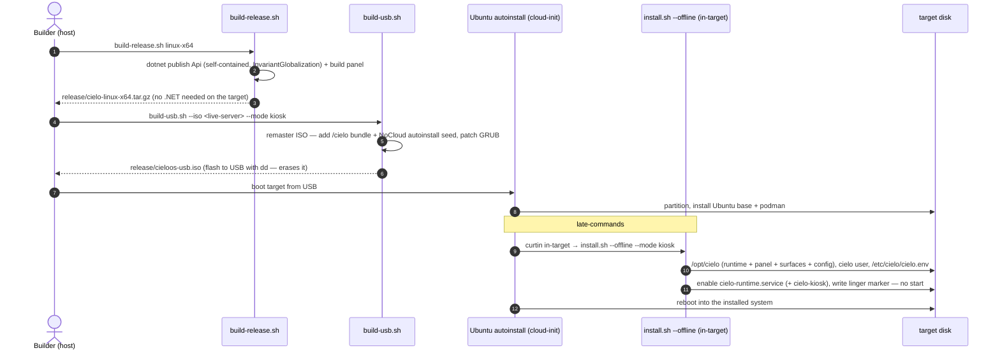
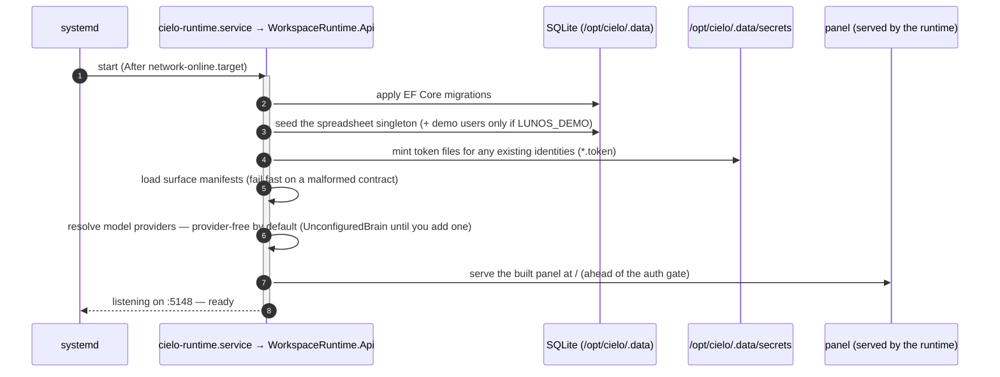
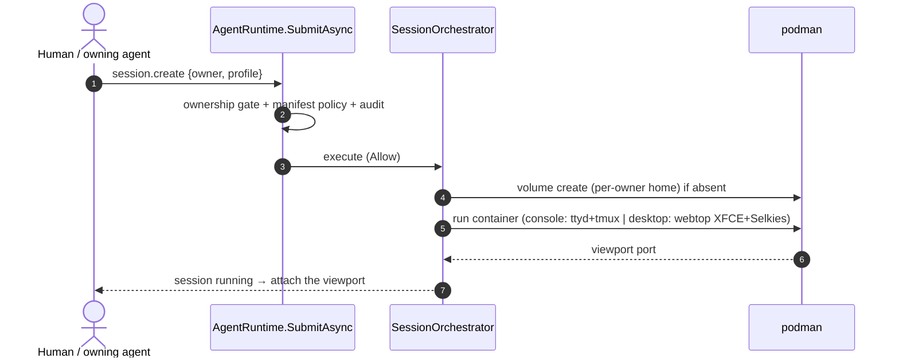

# Boot & Install Flow

How a CieloOS machine goes from media to a running command bus, and what happens on every boot. See [architecture-diagram.md](architecture-diagram.md) for the component map.

## Install — from media to an installed system

Two paths, one installer. On an **existing** Ubuntu box you run the release bundle's `install.sh` directly; for a **bare-metal appliance** an autoinstall USB does it unattended. Both end at the same `/opt/cielo` + `cielo-runtime.service`.

- **Release bundle (existing Ubuntu 24.04+):** `bash distro/scripts/build-release.sh linux-x64` → carry `release/cielo-<arch>.tar.gz` to the box → `tar xzf … && sudo ./cielo/install.sh --mode <app|headless|kiosk>`. The bundle is self-contained, so the target needs **no .NET**.
- **Autoinstall USB (bare metal):** `bash distro/scripts/build-usb.sh --iso <ubuntu-live-server> --mode kiosk` remasters the ISO with the bundle + a NoCloud autoinstall seed; boot the USB and Ubuntu + CieloOS install unattended (the diagram below).

**What ends up on disk:** the self-contained runtime at `/opt/cielo/bin/WorkspaceRuntime.Api` (which **serves its own panel**), the surface manifests, `config/branding.json`, a provider-free `/etc/cielo/cielo.env`, and one systemd unit — `cielo-runtime.service` (plus `cielo-kiosk.service` in kiosk mode). No .NET, no Postgres — a single **SQLite** DB under `/opt/cielo/.data`.

## Boot — every start

The runtime's **eager bootstrap** (migrations → seed → tokens → surfaces) runs before it accepts a request. A **fresh, provider-free** machine has *no users* — so the first request is the loopback-only **claim** (open `http://127.0.0.1:5148/` on the box, or `cielo-claim` over SSH), which creates the owner + agent and mints their tokens. No brains are registered until you add a provider from the panel's **Models** tab (or a key in `/etc/cielo/cielo.env`). In **kiosk** mode `cielo-kiosk.service` (cage + chromium) opens the panel fullscreen once the runtime is up.

## Sessions — created on demand

Nothing spins a container at boot. A session appears only when a command asks for one — and that command rides the same bus as everything else.

Sessions are **rootless podman** containers run by the `cielo` service user (its subuid/subgid + linger are set up by `install.sh`).

## Dev vs installed (a note)

The diagrams above describe the **installed product**: `cielo-runtime.service` runs the self-contained runtime and serves the panel on port **5148**. In active development, `./scripts/dev.sh` runs the backend (**5148**) and the Vite panel (**5173**) from source, with the panel proxying `/api` to the backend — same binary, same bootstrap, just hand-launched and hot-reloading. Set `LUNOS_DEMO=1` there to seed the `joche`/`yulia` demo identities instead of claiming an owner.
