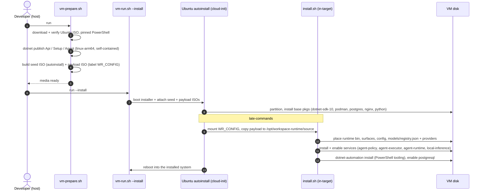
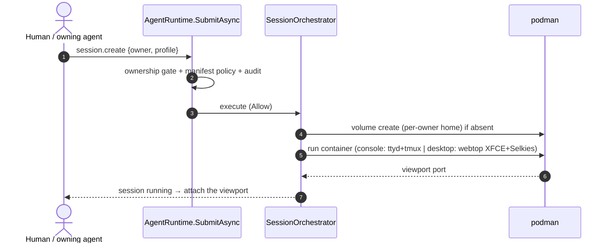

# Boot & Install Flow

How a Lun.Os machine goes from an ISO to a running command bus, and what happens on every boot. See [architecture-diagram.md](architecture-diagram.md) for the component map.

## Install — from media to an installed system

`vm-prepare.sh` builds the media on the dev host; `vm-run.sh --install` runs an **unattended Ubuntu autoinstall** that lays down the runtime and its services, then reboots.



**What ends up on disk:** the published runtime at `/opt/workspace-runtime/bin/workspace-runtime-api`, the surface manifests, `config/branding.json`, the **OS model registry** (`distro/models/registry.json` + `providers/*.json`, capability-tagged — the OS scope of [model-config.md](model-config.md)), and four systemd units.

## Boot — every start

```mermaid
sequenceDiagram
    autonumber
    participant SD as systemd
    participant PG as postgresql
    participant LI as local-inference.service
    participant LL as llama-server (Bonsai-4B)
    participant RT as agent-policy.service → workspace-runtime-api
    participant DB as SQLite / Postgres
    participant FS as .data/secrets

    SD->>PG: start
    SD->>LI: start
    LI->>LL: workspace-model run → serve Bonsai on 127.0.0.1:8080
    LL-->>LI: pull + verify model if missing, then /health OK
    SD->>RT: start (After postgresql)
    activate RT
    RT->>DB: apply EF Core migrations
    RT->>DB: seed identities (joche, yulia + their agents) if empty
    RT->>FS: mint per-user session tokens (*.token)
    RT->>RT: load surface manifests (fail fast on a malformed contract)
    RT->>RT: register brains (chat: deepseek / gpt-4.1-mini; vision) + read OS model registry
    RT->>RT: SharedInboxWatcher baselines each owner's inbox
    RT-->>SD: listening — ready
    deactivate RT
```

The runtime's **eager bootstrap** (migrations → seed → tokens → surfaces → brains) runs before it accepts a request, so a fresh install has its identities and token files before anyone can present one. `agent-executor.service` is a placeholder today; `agent-runtime.service` is a status one-shot after policy + inference are up.

## Sessions — created on demand

Nothing spins a container at boot. A session appears only when a command asks for one — and that command rides the same bus as everything else.



## Dev vs installed (a note)

The diagrams above describe the **installed product**: the baked runtime is `agent-policy.service` on port **5148**. In active development we run a *second*, freshly-published runtime from `~/lunos` on **5150** (reached over an SSH tunnel, with the Vite panel proxying to it), so we can iterate without disturbing the installed service. Same binary, same bootstrap — just a different port and a hand-launched `start-lunos.sh`.
